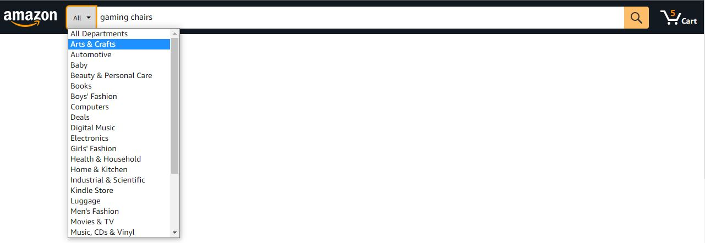
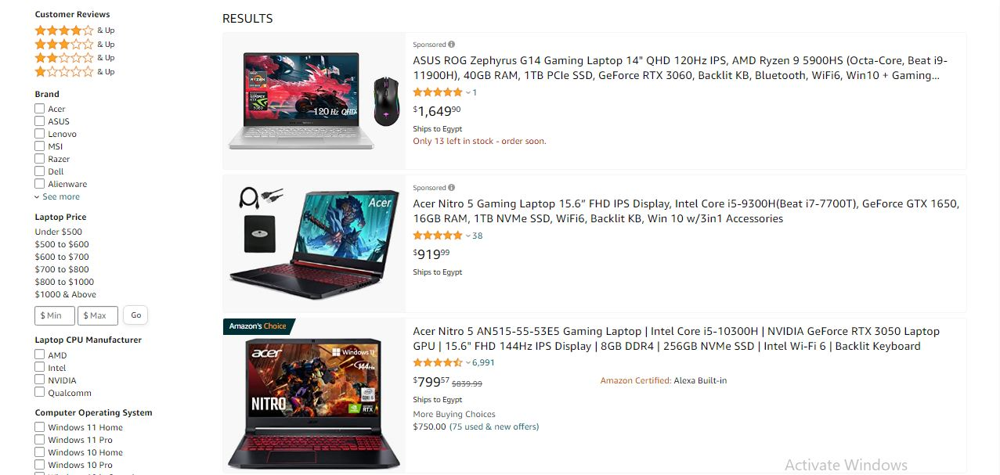
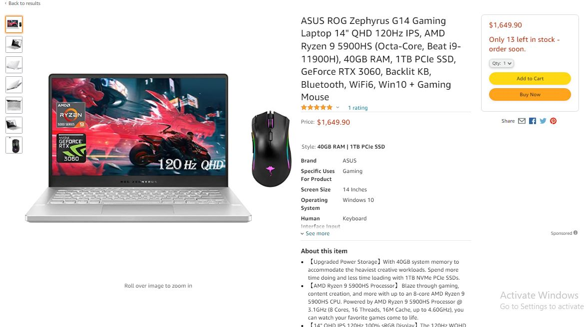

# Idea : Simple Ecommerce
This document explain the design of a simple ecommerce react app, where user can search for products and filter them and view a single product's page.

## `Main Page`
Our main page just have a sticky header which i a part of our layout and it has  the following elements :

**Logo**           : directing to the home page
**SearchbarInput** : a user can type in and search for any product
**DropdownSelect** : it shows a list of categories and a user can narrow his search by selecting a certain category
**Cart**           : a cart showing the number of items that the user have in his cart and when click the cart, it directs to the cart page.

## `Search Result Page`
A result page showing related product and its filters option based on category, it has the following elements :

**FilterSidebar**  : A sidebar showing filters based on category, each category has default filter options.
For example: laptops has filter options like [ brand - hard disk size - number of cpu cores - Computer Operating System  ]
if no category is selected, there will be default filters options like [price,rate].

**SearchResultSection**  : A section showing list of related products to the search keyword.

**SearchResultItem**  : An item representing the product and its short information [image,name,price,rating].

if no products match the search keyword, an error message is shown telling that no product is found.

## `Product Page`
This page represent a single product, it have the following elements :

**ProductGarelly** : showing images/videos of the product.
**ProductInformation**: this section have [name,price,rating,specs,description]
**ProductBuySection**: this section have add to cart/buy button.

